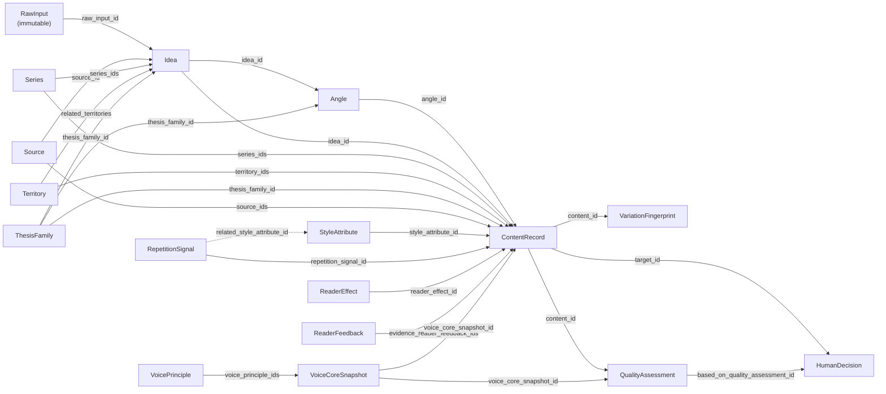

# B. Entity Map

## Relationsdiagram



Plana pilar (`-->`) = FK mot ett `*_id`-falt som kontrolleras av
`schema/integrity.py` och `tests/test_relation_integrity.py` /
`tests/test_voice_core_snapshot.py` / `tests/test_territory.py`.
Streckade pilar (`-.->`) = losa, icke-FK-relationer (t.ex.
`RepetitionSignal.related_style_attribute_id`, valfri).

**V1.1-andring:** `VoicePrinciple -.-> ContentRecord/QualityAssessment`
(en los etikett, `voice_core_version_ref`) ar ersatt av en riktig FK-kedja
via `VoiceCoreSnapshot` (OQ-1). `Territory` ar ett nytt register (OQ-3).

## Objekt och deras identitet

| Objekt | Primar-id | Ager sin egen livscykel? | Fil |
|---|---|---|---|
| RawInput | `raw_input_id` | Nej — skapas en gang, andras aldrig | `schema/raw_input.py` |
| Idea | `idea_id` | Ja — `IdeaStatus` | `schema/idea.py` |
| Source | `source_id` | Nej — statisk beskrivning av materialet | `schema/source.py` |
| Series | `series_id` | Nej — `active: bool` racker (register vaxer, andrar inte betydelse) | `schema/series.py` |
| Territory | `territory_id` | Nej — `active: bool`, samma monster som Series (V1.1, TP-8) | `schema/territory.py` |
| ThesisFamily | `thesis_family_id` | Nej — samma som Series | `schema/series.py` |
| VoicePrinciple | `voice_principle_id` | Ja — `VoicePrincipleStatus` (canonical/supported/proposal/deprecated) | `schema/voice.py` |
| VoiceCoreSnapshot | `snapshot_id` | Nej — `active: bool` + `superseded_by`, samma monster som VoicePrinciple (V1.1, TP-8) | `schema/voice.py` |
| StyleAttribute | `style_attribute_id` | Nej — `active: bool` | `schema/voice.py` |
| RepetitionSignal | `repetition_signal_id` | Nej — `active: bool` | `schema/voice.py` |
| Angle | `angle_id` | Ja — `AngleStatus` | `schema/angle.py` |
| ReaderEffect | `reader_effect_id` | Nej — `active: bool` (taxonomi-post) | `schema/reader_effect.py` |
| ReaderFeedback | `reader_feedback_id` | Nej — `FeedbackVerificationStatus` beskriver tillforlitlighet, inte livscykel | `schema/reader_effect.py` |
| ContentRecord | `content_id` | Ja — `ContentStatus` | `schema/content.py` |
| VariationFingerprint | `content_id` (1:1 med ContentRecord) | Nej — ogonblicksbild | `schema/content.py` |
| QualityAssessment | `quality_assessment_id` | Ja — `QualityAssessmentResult` | `schema/quality.py` |
| HumanDecision | `decision_id` | Nej — ett beslut ar slutgiltigt nar det skapas | `schema/decision.py` |

## Vardeobjekt (ingen egen id, alltid inbaddade)

- `Provenance` — pa `IdeaInterpretation`, `Series`, `Territory`,
  `ThesisFamily`, `VoicePrinciple.evidence`, `VoiceCoreSnapshot`,
  `StyleAttribute`, `RepetitionSignal`, `Angle`, `ReaderEffect`,
  `ContentRecord`, `QualityAssessment`.
- `ContentWhat`, `ContentForm` — inbaddade i `ContentRecord` (Beslut 8:s
  "vad texten sager" / "hur texten ar byggd"-uppdelning).
- `ReaderEffectAssociation` — inbaddad i `ContentRecord.reader_effects`.
- `QualityRuleFinding` — inbaddad i `QualityAssessment.findings`.

## De fyra variationsdimensionerna (Beslut 10) i modellen

| Dimension | Var den lever |
|---|---|
| CONTENT | `ContentRecord.what` (`ContentWhat`) |
| PERSPECTIVE | `ContentWhat.perspective` |
| FORM | `ContentRecord.form_detail` (`ContentForm`) + `VariationFingerprint` |
| EFFECT | `ContentRecord.reader_effects` (`ReaderEffectAssociation`) |

## Kedjan RAW INPUT -> ... -> HUMAN DECISION, som referenser

```
RawInput(raw_input_id)
  <- Idea(raw_input_id, interpretation: IdeaInterpretation)
       <- Angle(idea_id)
            <- ContentRecord(idea_id, angle_id)
                 <- VariationFingerprint(content_id)   [1:1, avledd]
                 <- QualityAssessment(content_id)
                      <- HumanDecision(target_id=content_id | quality_assessment_id via based_on_quality_assessment_id)
Source(source_id) referens fran: Idea, ContentRecord
Series/Territory/ThesisFamily referens fran: Idea, Angle (endast ThesisFamily), ContentRecord
VoiceCoreSnapshot(voice_principle_ids -> VoicePrinciple) referens fran: ContentRecord, QualityAssessment
StyleAttribute/RepetitionSignal/ReaderEffect referens fran: ContentRecord
ReaderFeedback(content_reference=content_id) -> ReaderEffectAssociation.evidence_reader_feedback_ids
```
